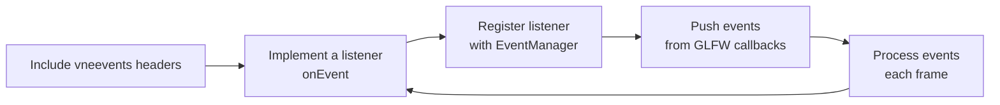

# 03: Events and Input

In [02: Adding Logging](./02-adding-logging) you used logging in your project. Next we add **events and input**: where they come from, how to handle them, and how to run the events sample. By the end you'll know how events and input are added and used, the same way you knew how logging was added from the previous page.

## Where Events and Input Come From

Your app gets **events** when something happens (key pressed, mouse moved, window resized). The window library (e.g. [GLFW](https://github.com/glfw/glfw)) reports these via [window and input callbacks](https://www.glfw.org/docs/3.3/window_guide.html#window_events). You need one place to receive those and turn them into a consistent set of event types. You also need **input polling** — "is this key held right now?" and "where is the mouse?" — once per frame.

In the VertexNova stack we use the [vneevents](https://github.com/vertexnova/vneevents) library for both: it gives you typed events (key, mouse, window, touch), a thread-safe queue, and an `Input` API for polling. The table below is a quick reference; full docs are in the [vneevents repository](https://github.com/vertexnova/vneevents).

| What you get | Purpose |
| ------------ | ------- |
| **Typed events** | One class per kind: key pressed, mouse moved, window resized, touch, etc. |
| **Modifiers** | Shift, Ctrl, Alt, Super on key and mouse events. |
| **Touch** | Touch press, move, release; on desktop LMB can emulate touch (e.g. touch id 0). |
| **Thread-safe queue** | Push events from one thread, process on another. |
| **Input polling** | `Input::isKeyPressed()`, `Input::mousePosition()`, etc.; call `Input::nextFrame()` once per frame. |

## Where to See It: vnetestbed and the Events Sample

The easiest way to **see events in action** is to run the **vnetestbed** sample that uses a [GLFW](https://github.com/glfw/glfw) window, OpenGL, and [Dear ImGui](https://github.com/ocornut/imgui/tree/docking) (docking branch). That sample is built to **test and demonstrate** every vneevents [events](https://github.com/vertexnova/vneevents) and [input](https://github.com/vertexnova/vneevents) API.

| What | Where |
| ---- | ------ |
| **Event library** | [vertexnova/vneevents](https://github.com/vertexnova/vneevents) |
| **Test app** | [vertexnova/vnetestbed](https://github.com/vertexnova/vnetestbed) |
| **Events sample** | `samples/glfw_opengl/01_test_events` — same sample has its own [README](https://github.com/vertexnova/vnetestbed/blob/main/samples/glfw_opengl/01_test_events/README.md) in the repo. |

When you run the sample you get a window with:

- **Events** — Last N events (key, mouse, window resize/close, touch) with type, data, and frame number.
- **Input Poll** — Live state: keys held (e.g. WASD, Space, Escape), mouse position, scroll, and touch.
- **Stats** — How many events were received in total and how many per second.

So you can press keys, move the mouse, scroll, and resize the window and **see exactly what events the library delivers**. That’s how we test that event delivery and polling work correctly.

## What the events sample shows

1. **Event delivery** — Keyboard, mouse button, mouse move, scroll, window resize, window close, and touch (press/move/release) events arrive with the correct type and data.
2. **Touch emulation** — Left mouse button is treated as touch id `0` (TouchPress, TouchMove, TouchRelease) so you can try touch on desktop; it’s turned on only in this demo.
3. **Event ordering** — You see the order of move vs pressed vs released in the event log.
4. **EventManager queue** — The Stats section shows events per second and total events, so you see the queue in use.
5. **Input polling** — The Input Poll panel shows “key held” and mouse/scroll state **separately** from the stream of one-off events.

The sample is both a **teaching tool** and a **test**: we use it to verify that calling events from GLFW works end-to-end.


## Get vnetestbed and run the events sample

On your machine:

```bash
git clone --recursive https://github.com/vertexnova/vnetestbed.git
cd vnetestbed
```

Turn on samples and build:

```bash
cmake -B build -DVNE_TESTBED_SAMPLES=ON
cmake --build build
```

Or use the project’s scripts (see the repo’s `scripts/README.md`):

```bash
# macOS
./scripts/build_macos.sh -t Debug -a configure_and_build

# Linux
./scripts/build_linux.sh -t Debug -a configure_and_build

# Windows
./scripts/build_windows.sh -t Debug -a configure_and_build
```

Run the events sample:

```bash
./build/bin/samples/sample_01_test_events
```

(If you used a script, the binary may live under `build/Debug/build-*/bin/samples/`.)

Use the window — keys, mouse, scroll, resize — and watch the **Events** and **Input Poll** panels. Exit with **ESC** or by closing the window.

## How we test events: GLFW and vneevents together

This section explains **how the testbed calls events from GLFW** so you get the full picture from this page.

### The flow in one sentence

GLFW tells us “something happened” via **callbacks**; we turn that into a **vneevents event** and push it into a queue; once per frame we **process** the queue and every **listener** gets `onEvent()`.

### Step by step

1. **GLFW callbacks**  
   When you create the window, we register functions with GLFW (e.g. for key, mouse button, mouse move, scroll, window close, window resize). When you press a key or move the mouse, GLFW calls the right function and passes the data (key code, position, etc.).

2. **Push into EventManager**  
   Inside each callback we create the matching vneevents event (e.g. `KeyPressedEvent`, `MouseMovedEvent`, `WindowResizeEvent`) and push it into the global **EventManager** queue. We also update the **Input** state (key held, mouse position, scroll) so polling APIs work.

3. **Process once per frame**  
   Each frame the application calls `EventManager::processEvents()`. That takes all events from the queue and **dispatches** them: every registered listener receives each event.

4. **Listeners handle events**  
   A listener is any code that implements `onEvent(const Event&)`. It can check `event.type()` and cast to the concrete type (e.g. `KeyPressedEvent`) to read key, position, modifiers, and so on. In the sample, **EventsLayer** does this and writes the last N events into the ImGui **Events** panel.

So: **GLFW (raw input) → callbacks → push vneevents → processEvents() → your onEvent()**. That’s how we test that events are delivered: we use a real GLFW window and see the same events in the UI.

**Touch emulation** (only in this sample): when the left mouse button is down, we also push `TouchPressEvent`, `TouchMoveEvent`, and `TouchReleaseEvent` so you can test touch on desktop without a touch screen.

## Events vs polling

- **Events** — “This just happened once”: key pressed, mouse moved, window resized. You get one event per occurrence.
- **Polling** — “What is the state right now?”: is key W held? Where is the mouse? You call things like `Input::isKeyPressed()` and `Input::mousePosition()` once per frame (and call `Input::nextFrame()` at the start of each frame).

The sample uses both: the **Events** panel shows the event stream; the **Input Poll** panel shows the current state. Both come from the same library (vneevents).

## Event types you’ll see

| Event class | Typical use |
| ----------- | ----------- |
| KeyPressedEvent / KeyReleasedEvent | Keyboard input. |
| MouseButtonPressedEvent / MouseButtonReleasedEvent | Mouse clicks. |
| MouseMovedEvent | Cursor position. |
| MouseScrolledEvent | Scroll wheel. |
| WindowResizeEvent | Window size changed. |
| WindowCloseEvent | Window closed; time to quit or clean up. |
| TouchPressEvent / TouchMoveEvent / TouchReleaseEvent | Touch (or emulated from mouse in the sample). |

## Use Events and Input in Your Code

The [vneevents Quick Start](https://github.com/vertexnova/vneevents#quick-start) shows the minimal pieces: a **listener class**, **register and process**, and a **per-frame loop** with input polling. Below is the same pattern you’ll use in your app or in the testbed.

### 1. Include and a listener class

```cpp
#include <vertexnova/events/events.h>

using namespace vne::events;

class MyListener : public EventListener {
public:
    void onEvent(const Event& event) override {
        if (event.type() == EventType::eKeyPressed) {
            auto& e = static_cast<const KeyPressedEvent&>(event);
            std::cout << "Key " << static_cast<int>(e.keyCode())
                      << " mods=" << static_cast<int>(e.modifiers()) << std::endl;
        }
    }
};
```

### 2. Register and process events

```cpp
auto& manager = EventManager::instance();

auto listener = std::make_shared<MyListener>();
manager.registerListener(EventType::eKeyPressed, listener);

manager.pushEvent(std::make_unique<KeyPressedEvent>(KeyCode::eA));
manager.pushEvent(std::make_unique<MouseMovedEvent>(100.0, 200.0));

manager.processEvents();
```

### 3. Per-frame loop with input polling

In a real app you run a loop: each frame you process events, then update game state (often using **polled** input), then call `Input::nextFrame()` so “just pressed” state is correct for the next frame.

```cpp
while (running) {
    // 1) Drain the event queue and notify listeners
    EventManager::instance().processEvents();

    // 2) Use polled input for movement, etc.
    if (Input::isKeyPressed(static_cast<int>(KeyCode::eW)))
        ; // move forward
    if (Input::isMouseButtonJustPressed(0)) {
        auto [x, y] = Input::mousePosition();
        ; // handle click at (x, y)
    }

    // 3) Once per frame: update "just pressed" / "just released" state
    Input::nextFrame();
}
```

Where events come from (e.g. GLFW callbacks) you still **push** into the manager: `EventManager::instance().pushEvent(std::make_unique<KeyPressedEvent>(...));`. The loop only **processes** and **polls**.



**Summary:** Include the headers, implement a listener (`onEvent`), register it with `EventManager::instance()`, push events from your window/input layer, and each frame call `processEvents()` and `Input::nextFrame()`. Same flow as the testbed; your app plugs in its own window backend and listeners.

## Summary

- **Events and input** are added by receiving window/input callbacks (e.g. from [GLFW](https://github.com/glfw/glfw)), turning them into typed events, pushing into a queue, and processing each frame so listeners get `onEvent()`. Polling uses `Input::isKeyPressed()`, `Input::mousePosition()`, and `Input::nextFrame()`.
- The [vneevents](https://github.com/vertexnova/vneevents) library provides the event types, queue, and Input API; full docs and the sample [README](https://github.com/vertexnova/vnetestbed/blob/main/samples/glfw_opengl/01_test_events/README.md) are in the repos.

## Next steps

- **Go deeper on vneevents**: [vneevents README](https://github.com/vertexnova/vneevents) — Quick Start, all event types, building, and examples (including GLFW integration).
- **Go deeper on vnetestbed**: [vnetestbed README](https://github.com/vertexnova/vnetestbed) — Layout, build, test, and the testbed [docs](https://github.com/vertexnova/vnetestbed/tree/main/docs).
- **More Learn chapters**: See the [Learn by Building](/docs/docs/learn) index for what’s next.
